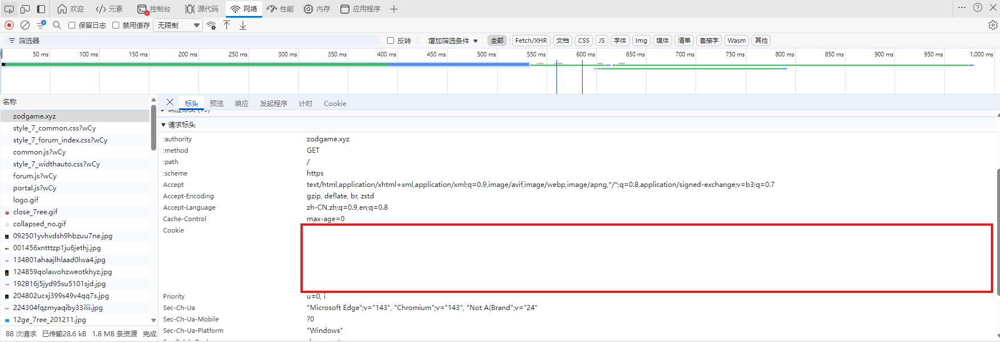

# ZodGame 自动签到工具

一个用于 ZodGame 论坛的自动签到工具，支持多账号签到、Cookie 自动验证、随机心情签到等功能。

## 功能特点

- ✅ **多账号支持**：同时管理多个 ZodGame 论坛账号
- 🔍 **Cookie 验证**：自动检查 Cookie 有效性
- 🎲 **随机心情**：每次签到使用随机心情
- 📝 **自动配置**：首次运行自动生成配置模板
- 📱 **通知支持**：可选的签到结果通知功能
- 🛡️ **Cloudflare 绕过**：使用 cloudscraper 自动绕过 Cloudflare 保护

## 环境要求

- Python 3.7 及以上
- Windows/Linux

## 安装步骤

### 1. 克隆项目

```bash
git clone https://github.com/wumiyangguang/Zodgame-Automatic-check-in.git
cd zodgame-checkin
```

### 2. 安装依赖

```bash
pip install -r requirements.txt
```

## 配置说明

### 1. 获取 Cookie

1. 打开浏览器，登录 ZodGame 论坛：[https://zodgame.xyz/](https://zodgame.xyz/)
2. 按 F12 打开开发者工具
3. 切换到 `Network` 或 `网络` 标签页
4. 找到 `zodgame.xyz`
5. 复制 `cookie` 值（包含所有键值对的完整字符串）



### 2. 配置文件

首次运行程序会自动生成 `config.json` 配置文件模板：

```json
{
  "accounts": [
    {
      "name": "账号1",
      "cookie": "",
      "enabled": true
    },
    {
      "name": "账号2",
      "cookie": "",
      "enabled": false
    }
  ],
  "notification": {
    "enabled": false
  }
}
```

#### 配置参数说明：

- `accounts`：账号列表
  - `name`：账号名称（用于标识）
  - `cookie`：从浏览器复制的完整 Cookie 字符串
  - `enabled`：账号是否启用（`true`/`false`）

- `notification`：通知配置
  - `enabled`：是否启用通知（`true`/`false`）

### 3. 环境变量配置（可选）

可以通过环境变量指定配置文件路径：

```bash
export ZODGAME_CONFIG_PATH="/path/to/your/config.json"
```

## 使用方法

### 1. 基本使用

```bash
python main.py
```

### 2. 定时任务（推荐）

#### Windows

使用任务计划程序创建定时任务：

1. 打开「任务计划程序」
2. 点击「创建基本任务」
3. 设置任务名称和描述
4. 选择触发频率（建议每天）
5. 选择「启动程序」
6. 浏览选择 `python.exe`，添加参数 `main.py`
7. 完成创建

#### Linux/macOS

使用 crontab 创建定时任务：

```bash
# 编辑 crontab
crontab -e

# 添加以下行（每天 9:00 执行）
0 9 * * * cd /path/to/zodgame-checkin && python main.py
```

### 3. 青龙面板

#### 1. 添加脚本

1. 登录青龙面板
2. 点击「脚本管理」→「添加脚本」
3. 填写脚本信息：
   - **名称**：ZodGame自动签到
   - **命令**：`ql repo https://github.com/wumiyangguang/Zodgame-Automatic-check-in.git "main.py|util.py|config.py|requirements.txt" "README.md|LICENSE" "cloudscraper|lxml"`
   - **定时类型**：定时
   - **定时规则**：`0 9 * * *`（每天9:00执行）
4. 点击「确定」添加脚本

#### 2. 配置依赖

青龙面板会自动安装依赖，也可以手动安装：

```bash
# 在青龙面板的「依赖管理」→「Python3」中添加
type: pip
name: cloudscraper
name: lxml
```

#### 3. 配置方式

##### 方式一：配置文件路径（推荐）

在青龙面板的「环境变量」中指定配置文件路径：

- **名称**：`ZODGAME_CONFIG_PATH`
- **值**：`/ql/data/config/zodgame.json`（可自定义路径）
- **备注**：ZodGame签到配置文件路径

然后在指定路径创建配置文件，内容与本地配置相同。

##### 方式二：脚本目录配置文件（不推荐）

在青龙面板的「文件管理」中找到 `/ql/data/scripts/Zodgame-Automatic-check-in/` 目录
创建或编辑 `config.json` 文件，内容与本地配置相同：

```json
{
  "accounts": [
    {
      "name": "账号1",
      "cookie": "your_cookie_here",
      "enabled": true
    }
  ],
  "notification": {
    "enabled": true
  }
}
```

#### 5. 执行测试

点击脚本列表中的「运行」按钮测试签到功能，检查日志输出是否正常。

## 运行示例

```
✅ 配置文件 config.json 不存在，已自动创建模板配置

======== 开始签到 ========
账号1: 正在签到...
账号2: ⚠️  账号已禁用，跳过签到

======== 签到结果 ========
账号1: ✅ 签到成功！获得随机奖励 酱油 4 瓶

======== 签到完成 ========
```

## 常见问题

### Q: Cookie 无效怎么办？
A: 重新登录论坛获取新的 Cookie 并更新配置文件。

### Q: 为什么提示无法提取 formhash？
A: 可能是论坛结构更新或 Cookie 失效，请检查 Cookie 是否有效。

### Q: 如何开启通知功能？
A: 在配置文件中将 `notification.enabled` 设置为 `true`，通知功能默认使用青龙面板的通知功能，需要在青龙面板中配置通知接收方。非青龙面板需自定义实现 `notify.py` 文件。


## 许可证

本项目采用 MIT 许可证 - 查看 [LICENSE](LICENSE) 文件了解详情。

## 免责声明

本工具仅供学习和个人使用，请勿用于任何商业用途。使用本工具产生的所有后果由使用者自行承担，与作者无关。